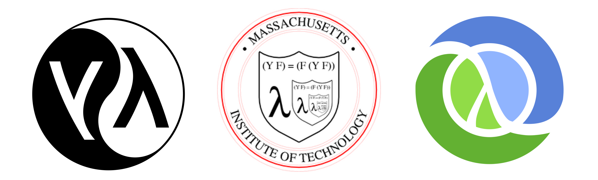

# Lisp/Common Lisp [Entria](https://github.com/entria) Talks by [@biantris](https://github.com/biantris)

<p align="center">

</p>

### 🚧 WIP 🚧

## Topics
<details>
  <summary>Lisp</summary>

  - Tem mais 50 de anos

  - É uma linguagem a princípio matemática

  - Nos anos 70 e 80 chegou a ser a principal linguagem da comunidade de IA

  - Lisp processing

  - A lista é a estrutura de dados fundamental da linguagem

  - Tudo é lista, permite que a linguagem manipule qualquer código fonte como qualquer outro tipo de dado.


</details>

<details>
  <summary>Lisp dialects</summary>
  <p align="center">
    
  </p>
</details>

<details>
  <summary>Macros</summary>

  - Uma macro é uma função que recebe uma expressão s como argumentos e retorna um formulário LISP, que é então avaliado.

  - Um programa que geram programas.

  - A definição da macro consiste no nome da macro, uma lista de parâmetros, uma string de documentação opcional e um corpo de expressões Lisp que definem o trabalho a ser executado pela macro.

  ```cl
  (defmacro macro-name (parameter-list))
  "Optional documentation string."
  body-form 
  ```

</details>

<details>
  <summary>Common Lisp</summary>

  - É um dialeto Lisp

  - Multiparadigma

  - Foi criada com o objetivo de combinar aspectos de diversos dialetos Lisp anteriores.

  - Foi projetada para ser uma linguagem comercial e ser compatível com os diversos dialetoss Lisp dos quais derivou.
</details>

<details>
  <summary>Lisp and Clojure</summary>

  - Clojure é um dialeto Lisp

  - É executada na Máquina Virtual Java (JVM)

  - Consegue utilizar recursos de Java

  - Clojure é mais objetiva que Java

  - Programação funcional 

  - Utilização de estruturas de dados imutáveis

  - Macros higiênicas
</details>

- editor online to common lisp https://rextester.com/l/common_lisp_online_compiler
- https://www.tutorialspoint.com/execute_lisp_online.php

### See more
  - https://betterprogramming.pub/why-i-still-lisp-and-you-should-too-18a2ae36bd8
  - http://www.lispworks.com/documentation/lw50/CLHS/Front/Contents.htm
  - https://pt.wikipedia.org/wiki/Lisp
  - https://pt.wikipedia.org/wiki/Common_Lisp
  - https://clojure.org/reference/lisps
  - https://clojure.org/about/lisp
  - https://pt.wikipedia.org/wiki/Clojure
